# Monorepo with android helloworlds

## Prerequisites
```bash
# This should be set in the .bashrc file
export ANDROID_HOME=$HOME/Android/Sdk
PATH=$PATH:/$ANDROID_HOME/platform-tools
PATH=$PATH:/$ANDROID_HOME/emulator
```

## Useful scripts
```bash
$ nix-shell --run bash --argstr jdkVersion 17 # default is 8

# pair physical device through wi-fi
$ adb pair host:port

# pair physical device through wi-fi
$ adb pair host:port

# If the device is busy or not responding
$ adb kill-server

# run virtual device
$ emulator -list-avds
$ emulator -avd Pixel_API_30 # example

```

## Usage of `view-bindings`
inside `app: sbuild.gradle`
```
android {
    ...
    buildFeatures {
        viewBinding = true
    }
}

will allow to use 
val binding = RowBinding.inflate(layoutInflater)
...
binding.titleView.text = myNote.noteName
```


## The Notes App:
- Room Database
- MVVM
- Navigation safe args

|   |  |
| ------------- | ------------- |
| 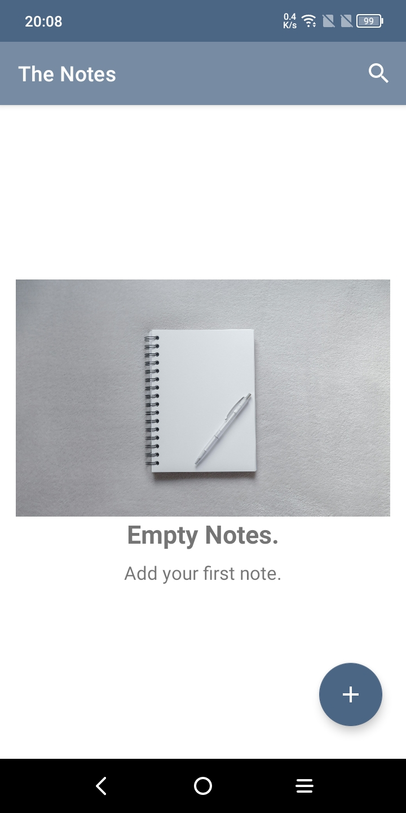  |    |
| 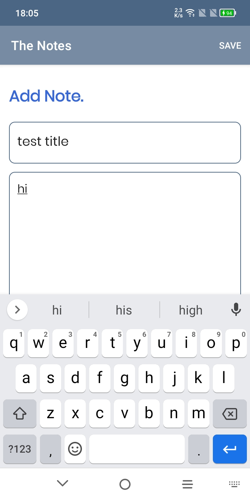  | 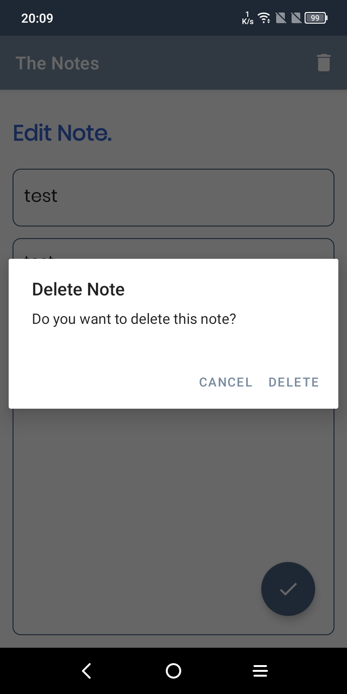  |


## The News App:
- Room Database
- MVVM
- Retrofit
- Navigation safe args

|   |  |
| ------------- | ------------- |
| 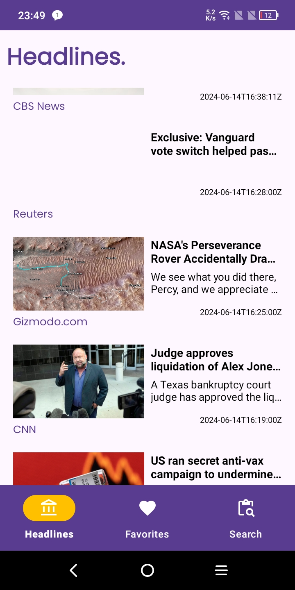  |    |
| 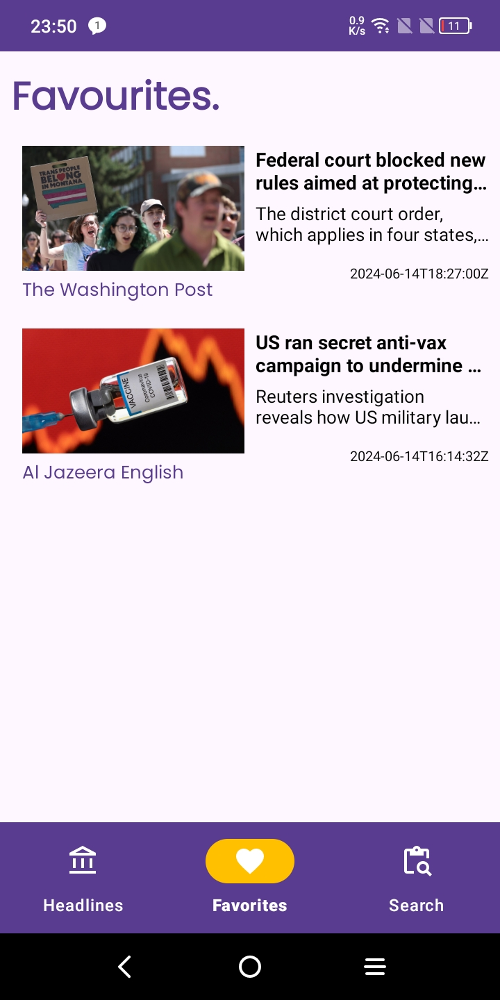  | 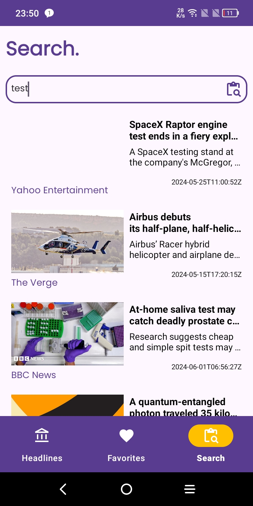  |

## The News App:
- Room Database
- MVVM
- Retrofit
- Navigation safe args

|   |  |
| ------------- | ------------- |
| 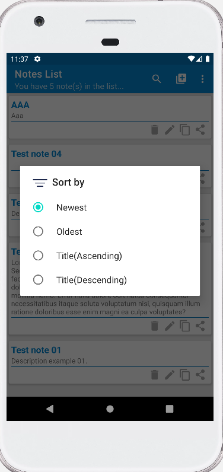  | 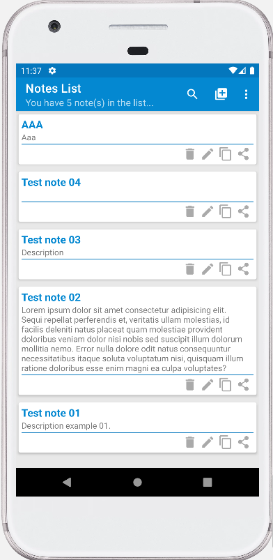   |
| 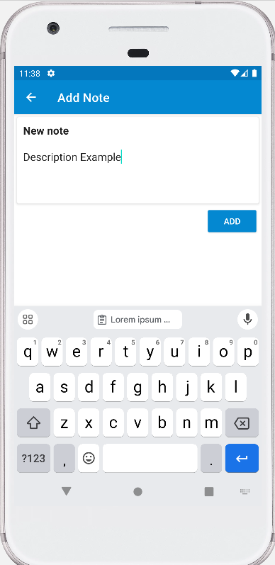  | 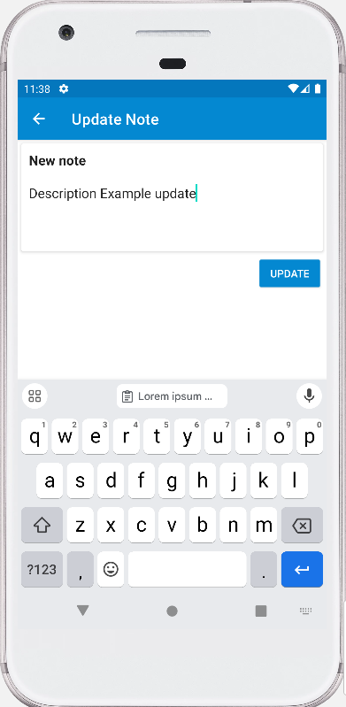  |
| 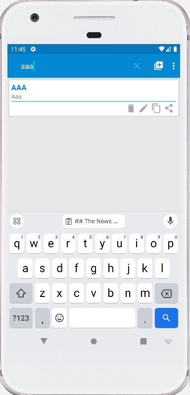  | 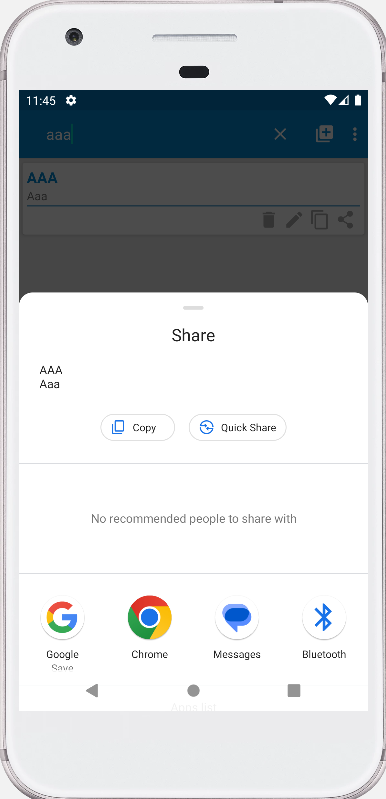  |

## Navigation Menu Example:
- Splash Screen (library)
- Navigation Menu

|   |  |
| ------------- | ------------- |
| 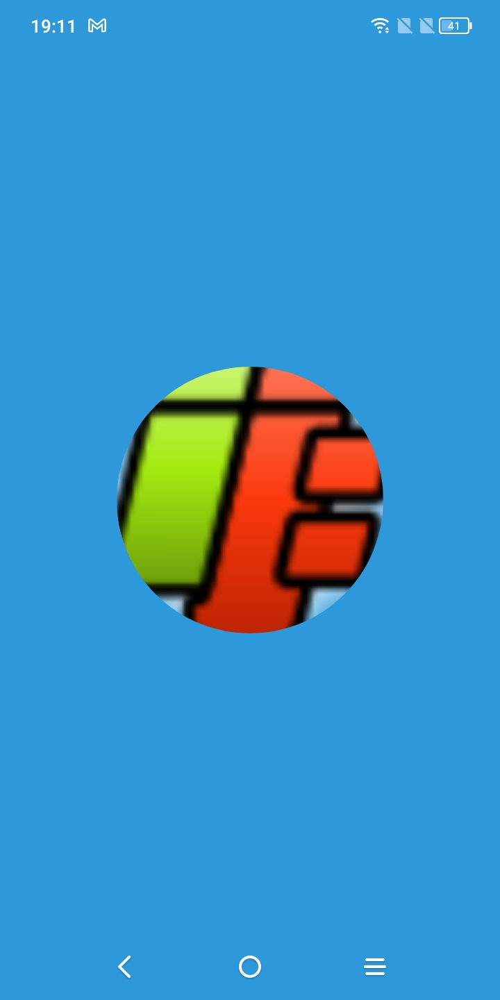  | 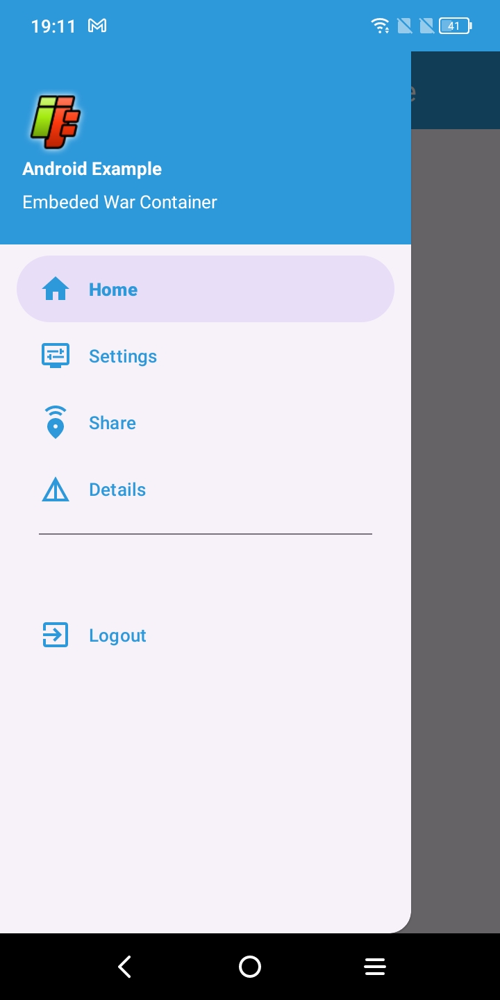   |

## Q&A
- How to mark activity as a entry point in application?
  - `android:exported="true"` and `intent-filter` as described below
    ```xml
    <activity android:name=".ui.MainActivity" android:exported="true">
        <intent-filter>
            <action android:name="android.intent.action.MAIN" />
            <category android:name="android.intent.category.LAUNCHER" />
        </intent-filter>
    </activity>
    ```

## References 
- https://www.svgrepo.com/
- [**Google Android Samples**](https://github.com/android/architecture-components-samples)
