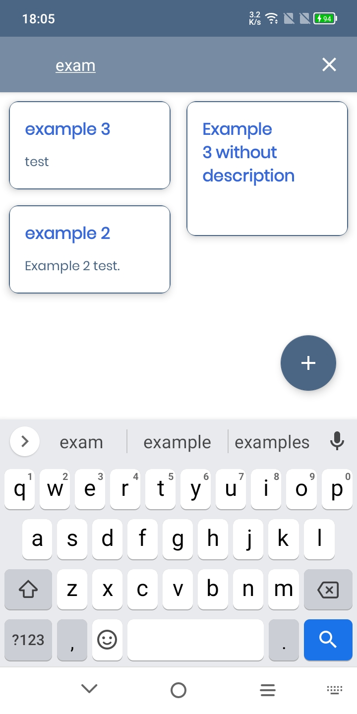

# Monorepo with android helloworlds

## The Notes App:
- Room Database
- MVVM
- Navigation safe args

 \
 \
 \
 \
 

## The News App:
- Room Database
- MVVM
- Retrofit
- Navigation safe args

 \
 \
 \
 
