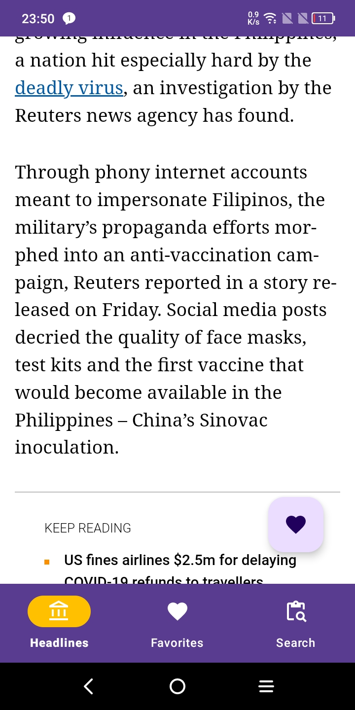

# Monorepo with android helloworlds

## Prerequisites
```bash
# This should be set in the .bashrc file
export ANDROID_HOME=$HOME/Android/Sdk
PATH=$PATH:/$ANDROID_HOME/platform-tools
PATH=$PATH:/$ANDROID_HOME/emulator
```

## Useful scripts
```bash
$ nix-shell --run bash --argstr jdkVersion 17 # default is 8

# pair physical device through wi-fi
$ adb pair host:port

# run virtual device
$ emulator -list-avds
$ emulator -avd Pixel_API_30 # example

```

## The Notes App:
- Room Database
- MVVM
- Navigation safe args

 \
 \
 \
 \
 

## The News App:
- Room Database
- MVVM
- Retrofit
- Navigation safe args

 \
 \
 \
 
